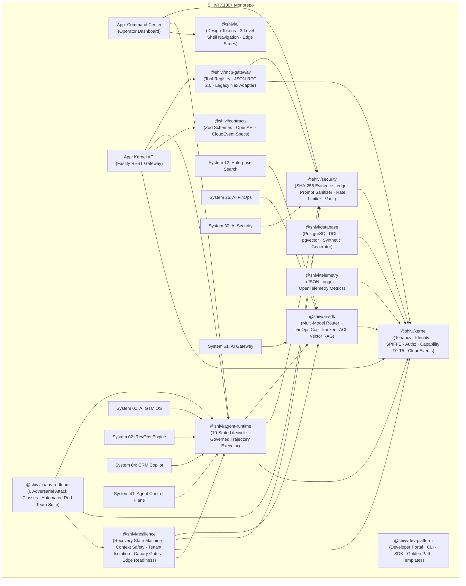

<p align="center">
  <strong>🔮 SHIVI X100+</strong>
</p>

<h3 align="center">Enterprise AI Operating Ecosystem</h3>

<p align="center">
  <em>Production-Grade · Secure · Scalable · Observable · AI-Native</em><br/>
  <em>Architected for High-Assurance Enterprise Operations across 100 Autonomous Systems</em>
</p>

<p align="center">
  <a href="#"></a>
  <a href="#"></a>
  <a href="#"></a>
  <a href="#"></a>
  <a href="#"></a>
</p>

<p align="center">
  <a href="#"></a>
  <a href="#"></a>
  <a href="#"></a>
  <a href="#"></a>
  <a href="#"></a>
</p>

---

## Table of Contents

- [What Is ShiVi X100+?](#what-is-shivi-x100)
- [Architecture Overview](#architecture-overview)
- [Monorepo Structure](#monorepo-structure)
- [Core Platform Packages](#core-platform-packages)
- [Applications](#applications)
- [Domain Modules](#domain-modules)
- [Contract & Frontend Layers](#contract--frontend-layers)
- [Security, Resilience & Governance](#security-resilience--governance)
- [Red-Team Chaos Containment](#red-team-chaos-containment)
- [API Reference](#api-reference)
- [Infrastructure & Deployment](#infrastructure--deployment)
- [Test Evidence](#test-evidence)
- [Quick Start](#quick-start)
- [Architecture Decision Records](#architecture-decision-records)
- [Documentation Library](#documentation-library)
- [Roadmap](#roadmap)
- [License](#license)

---

## What Is ShiVi X100+?

**SHIVI X100+** is a unified, enterprise-grade AI operating platform designed to orchestrate **100 domain-specific business systems** on top of a zero-trust, multi-tenant kernel framework. It is not a chatbot wrapper or a simple copilot — it is a governed, auditable, multi-model AI operating system for B2B SaaS.

### Core Principles

| Principle | Implementation |
|---|---|
| **Zero-Trust Multi-Tenancy** | Every request carries a `TenancyContext` with data classification (`PUBLIC` → `RESTRICTED`), enforced at kernel level |
| **Cryptographic Audit Trail** | SHA-256 tamper-evident hash-chain evidence ledger for every agent decision, tool invocation, and trajectory step |
| **Governed Agent Lifecycle** | Deterministic 10-state lifecycle: `DRAFT` → `EVALUATING` → `SECURITY_REVIEW` → `STAGING` → `CANARY` → `ACTIVE` → `DEGRADED` → `QUARANTINED` → `REVOKED` → `RETIRED` |
| **Capability-Based AuthZ** | Risk-tier classification (T0–T5) with delegation limits and mandatory HITL approval gates for sensitive operations |
| **Multi-Model FinOps** | Dynamic model router (Gemini 1.5 Pro/Flash, Claude Sonnet, GPT-4o, Local Ollama) with real-time USD token cost tracking and budget circuit breakers |
| **Continuous Red-Team** | Built-in 6-pillar Edge Readiness scoring and automated adversarial red-team chaos simulation (100% containment rate) |
| **Prevention → Detection → Containment → Recovery → Evidence → Verification** | The operational lifecycle for every security and resilience concern |

---

## Architecture Overview



### Layered Architecture

```
┌──────────────────────────────────────────────────────────────────────┐
│                        APPLICATIONS LAYER                            │
│   Command Center Dashboard  ·  Kernel API Gateway  ·  Developer CLI  │
├──────────────────────────────────────────────────────────────────────┤
│                     DOMAIN MODULES LAYER (×100)                      │
│  GTM OS · RevOps · CRM · Search · FinOps · Security · Control Plane  │
├──────────────────────────────────────────────────────────────────────┤
│                     PLATFORM SERVICES LAYER                          │
│  Agent Runtime · AI SDK · MCP Gateway · Resilience · Chaos Red-Team  │
├──────────────────────────────────────────────────────────────────────┤
│                    INFRASTRUCTURE LAYER                               │
│  Kernel · Contracts · Database · Telemetry · Security · UI Tokens    │
├──────────────────────────────────────────────────────────────────────┤
│                    INFRASTRUCTURE (External)                         │
│  PostgreSQL + pgvector  ·  Redis 7  ·  Docker  ·  Vercel            │
└──────────────────────────────────────────────────────────────────────┘
```

---

## Monorepo Structure

```
ShiVi/
├── packages/                    # Core platform packages (12)
│   ├── kernel/                  #   Tenancy, Identity, AuthZ, Capability, Events
│   ├── contracts/               #   Zod runtime validation schemas
│   ├── database/                #   PostgreSQL DDL, pgvector, synthetic data
│   ├── telemetry/               #   Structured logging, OpenTelemetry metrics
│   ├── security/                #   Evidence ledger, prompt sanitizer, vault, rate limiter
│   ├── ai-sdk/                  #   Multi-model router, FinOps tracker, RAG pipeline
│   ├── agent-runtime/           #   10-state lifecycle, trajectory executor
│   ├── mcp-gateway/             #   Tool registry, JSON-RPC 2.0, legacy adapter
│   ├── ui/                      #   Design tokens, shell navigation, edge states
│   ├── resilience/              #   Recovery FSM, context safety, tenant isolation
│   ├── chaos-redteam/           #   Automated adversarial red-team suite
│   └── dev-platform/            #   Developer portal, CLI, golden path templates
├── apps/                        # Deployable applications (2)
│   ├── kernel-api/              #   Fastify REST API Gateway (port 3000)
│   └── command-center/          #   Operator dashboard view model
├── domains/                     # Business domain modules (8 implemented, 100 planned)
│   ├── 01-gtm-os/               #   AI GTM Operating System
│   ├── 02-revops-engine/        #   Autonomous RevOps Engine
│   ├── 04-crm-copilot/          #   AI CRM Copilot
│   ├── 12-enterprise-search/    #   Enterprise Search Domain
│   ├── 25-ai-finops/            #   AI FinOps Domain
│   ├── 30-ai-security/          #   AI Security Domain
│   ├── 41-agent-control-plane/  #   Agent Control Plane
│   └── 61-ai-gateway/           #   AI Gateway Domain
├── contracts/                   # Shared contract layer (OpenAPI specs)
│   ├── openapi/                 #   OpenAPI 3.1 specifications
│   └── src/                     #   Contract source modules
├── frontend/                    # Frontend platform workspace
│   └── packages/                #   Frontend-specific packages
├── research/                    # Research & architecture documents
│   └── mcp-ecosystem-matrix.md  #   MCP ecosystem analysis
├── public/                      # Static assets
├── .github/workflows/           # CI/CD pipeline definitions
├── docker-compose.yml           # Full-stack local dev (API + Postgres + Redis)
├── Dockerfile                   # Multi-stage production build
├── pnpm-workspace.yaml          # Workspace definition
├── tsconfig.base.json           # Shared TypeScript configuration
├── vitest.config.ts             # Test runner configuration
└── vercel.json                  # Edge deployment config
```

---

## Core Platform Packages

### `@shivi/kernel` — Platform Kernel

The kernel is the foundational layer. Every other package depends on it.

| Component | Responsibility |
|---|---|
| `TenancyManager` | Multi-tenant workspace isolation with data classification (`PUBLIC`, `INTERNAL`, `CONFIDENTIAL`, `RESTRICTED`) |
| `IdentityContext` | SPIFFE-compatible SVID identity parsing and verification |
| `CapabilityBroker` | Risk-tier capability tokens (T0–T5) with delegation depth limits |
| `AuthorizationEngine` | Policy evaluation via OpenFGA/OPA integration |
| `ContextCompiler` | Assembles execution context from tenant, identity, and capability data |
| `EventBus` | CloudEvents 1.0 compliant event backbone for inter-domain communication |

---

### `@shivi/contracts` — Runtime Validation

Zod-based runtime contract schemas ensuring type safety at every system boundary.

- `TenancySchema` — Tenant context validation
- `AgentManifestSchema` — Agent registration contracts
- `AgentExecutionTaskSchema` — Task execution payloads
- `McpJsonRpcRequestSchema` — MCP protocol message validation
- `OutboxEventSchema` — Transactional outbox event contracts
- `TrajectorySchema` — Agent trajectory step contracts

---

### `@shivi/database` — Data Layer

| Feature | Detail |
|---|---|
| PostgreSQL DDL | Full schema with `pgvector` `vector(1536)` columns for embedding storage |
| Postgres connection pool | Production-ready connection management |
| Redis cache layer | High-speed caching and session management |
| Synthetic data generator | Test data generation for development and CI |

---

### `@shivi/security` — Security Engine

| Module | Function |
|---|---|
| `EvidenceLedger` | SHA-256 tamper-evident hash-chain audit log for every agent action |
| `PromptSanitizer` | Adversarial prompt injection detection (DAN, system prompt override, jailbreak patterns) |
| `RateLimiter` | Per-tenant, per-endpoint rate limiting with sliding window |
| `Vault` | Secrets management abstraction for API keys and credentials |

---

### `@shivi/ai-sdk` — Multi-Model AI Engine

| Module | Function |
|---|---|
| `ModelRouter` | Dynamic task-complexity routing across Gemini 1.5 Pro, Gemini 1.5 Flash, Claude Sonnet 3.5, GPT-4o, Local Ollama |
| `ModelCostTracker` | Real-time USD token cost accounting with per-tenant budget circuit breakers |
| `VectorRetrievalEngine` | ACL-scoped RAG pipeline with chunk-level SHA-256 integrity verification |
| `RAGPipeline` | End-to-end retrieval-augmented generation with citation integrity checks |

---

### `@shivi/agent-runtime` — Agent Lifecycle Engine

Deterministic 10-state lifecycle state machine:

```
DRAFT → EVALUATING → SECURITY_REVIEW → STAGING → CANARY → ACTIVE
                                                      ↓
                                              DEGRADED → QUARANTINED → REVOKED → RETIRED
```

| Module | Function |
|---|---|
| `AgentLifecycleManager` | State transitions with guard conditions and HITL approval gates |
| `AgentExecutor` | Governed trajectory execution with step-level evidence recording |

---

### `@shivi/mcp-gateway` — Tool Protocol Gateway

| Module | Function |
|---|---|
| `ToolRegistry` | Dynamic tool registration with capability-scoped access control |
| `McpGatewayServer` | JSON-RPC 2.0 protocol router for MCP tool invocations |
| `LegacyNexAdapter` | Adapter bridge for legacy `.nex/flowstream` tool definitions |

---

### `@shivi/resilience` — Resilience Framework

| Module | Function |
|---|---|
| `AgentRecoveryStateMachine` | Automated agent recovery from degraded/quarantined states |
| `ContextSafetyPipeline` | RAG chunk hash verification, context rot detection, stale knowledge flagging |
| `TenantIsolationVerifier` | Runtime cross-tenant data leak detection |
| `CanaryReplayGates` | Canary deployment validation with automated rollback triggers |
| `EdgeReadinessScorer` | 6-pillar production readiness assessment engine |
| `SystemDegradationManager` | Graceful degradation mode orchestration |

---

### `@shivi/chaos-redteam` — Red-Team Chaos Suite

Automated adversarial testing engine covering 6 attack classes. See [Red-Team Containment](#red-team-chaos-containment) for results.

---

### `@shivi/ui` — Design System & Shell

| Module | Function |
|---|---|
| `ShiViDesignTokens` | Complete design token system (surfaces, colors, depth, typography, spacing) |
| `ShellNavigationEngine` | 3-level shell navigation (Global → Workspace → Detail) |
| `EdgeStateEngine` | 17-state UX engine for loading, error, empty, offline, and degraded states |

---

### `@shivi/dev-platform` — Developer Experience

Golden-path templates, CLI scaffolding, and SDK generation for domain module authors.

---

## Applications

### `@shivi/app-kernel-api` — REST API Gateway

Production Fastify REST API exposing the platform's core services.

| Endpoint | Method | Purpose |
|---|---|---|
| `/health` | `GET` | Health check (liveness + readiness) |
| `/api/v1/tenants` | `POST` | Tenant registration and provisioning |
| `/api/v1/agents/register` | `POST` | Agent manifest registration |
| `/api/v1/agents/execute` | `POST` | Governed agent task execution |
| `/api/v1/mcp/rpc` | `POST` | MCP JSON-RPC 2.0 tool invocation |
| `/api/v1/events/stream` | `GET` | Server-Sent Events (SSE) real-time stream |

### `@shivi/app-command-center` — Operator Dashboard

Real-time operator dashboard providing:
- Agent fleet health monitoring (active, quarantined, degraded counts)
- Evidence ledger chain integrity verification
- 3-level shell navigation state management
- Design system token integration

---

## Domain Modules

8 domain modules are implemented. The architecture supports 100.

| System # | Domain | Package | Responsibility |
|---|---|---|---|
| 01 | AI GTM OS | `@shivi/domain-gtm-os` | Go-to-market automation, pipeline forecasting, ICP scoring |
| 02 | RevOps Engine | `@shivi/domain-revops-engine` | Revenue operations automation, funnel analytics, attribution |
| 04 | CRM Copilot | `@shivi/domain-crm-copilot` | AI-powered CRM operations, contact enrichment, deal intelligence |
| 12 | Enterprise Search | `@shivi/domain-enterprise-search` | Cross-system semantic search with ACL-scoped vector retrieval |
| 25 | AI FinOps | `@shivi/domain-ai-finops` | AI spend optimization, model cost analysis, budget governance |
| 30 | AI Security | `@shivi/domain-ai-security` | Security posture monitoring, threat detection, compliance |
| 41 | Agent Control Plane | `@shivi/domain-agent-control-plane` | Fleet-wide agent lifecycle management and orchestration |
| 61 | AI Gateway | `@shivi/domain-ai-gateway` | Multi-model routing gateway with tenant-scoped cost tracking |

Each domain module follows a standard structure:
```
domains/<NN>-<name>/
├── package.json
├── tsconfig.json
└── src/
    ├── index.ts           # Domain implementation
    └── __tests__/
        └── *.test.ts      # Domain test suite
```

---

## Contract & Frontend Layers

### `contracts/` — Shared Contract Layer
OpenAPI 3.1 specifications and shared contract source modules for frontend/backend interoperability.

### `frontend/` — Frontend Platform
Dedicated frontend workspace for web, mobile, and admin interfaces (Next.js, React 19.2, TanStack Query, shadcn/ui, Radix UI).

---

## Security, Resilience & Governance

The platform implements a **6-stage operational lifecycle** for every security and resilience concern:

```
Prevention → Detection → Containment → Recovery → Evidence → Verification
```

### Trust Boundaries

| Boundary | Enforcement |
|---|---|
| Tenant Isolation | Kernel-level `TenancyManager` with data classification gates |
| Agent Capability | Risk-tier (T0–T5) capability tokens with delegation depth limits |
| Model Access | Per-tenant model routing with budget circuit breakers |
| Tool Invocation | Capability-scoped MCP tool registry with audit logging |
| Data Retrieval | ACL-scoped vector retrieval with chunk-level integrity |
| Prompt Safety | Adversarial injection scanning before every LLM call |

### Agent Lifecycle Governance

Every agent must pass through security review and canary deployment before activation:

```
DRAFT → EVALUATING → SECURITY_REVIEW → STAGING → CANARY → ACTIVE
```

Degraded agents are automatically quarantined:

```
ACTIVE → DEGRADED → QUARANTINED → REVOKED → RETIRED
```

---

## Red-Team Chaos Containment

Automated adversarial testing results:

| # | Attack Vector | Category | Defense Mechanism | Result |
|---|---|---|---|---|
| 1 | System Prompt Override & DAN Jailbreak | `PROMPT_INJECTION` | `PromptSanitizer.scanInput()` | ✅ **Contained** |
| 2 | Cross-Tenant Database & Vector Read | `TENANT_LEAK` | `TenancyManager.assertTenantMatch()` | ✅ **Contained** |
| 3 | RAG Chunk SHA-256 Hash Tampering | `KNOWLEDGE_POISON` | `ContextSafetyPipeline.verifyChunkHash()` | ✅ **Contained** |
| 4 | Capability Escalation & Unbounded Delegation | `CAPABILITY_ESCALATION` | `CapabilityBroker.delegateToken()` | ✅ **Contained** |
| 5 | Primary LLM Provider Outage (500/RateLimit) | `PROVIDER_OUTAGE` | `ModelRouter` Fallback Chain | ✅ **Contained** |
| 6 | Cryptographic Audit Chain Tampering | `AUDIT_TAMPER` | `EvidenceLedger.verifyChainIntegrity()` | ✅ **Contained** |

**Edge Readiness Score: 100%** across all 6 pillars.

---

## API Reference

### Health Check
```bash
curl http://localhost:3000/health
# → { "status": "ok", "timestamp": "...", "uptime": 123.456 }
```

### Register Tenant
```bash
curl -X POST http://localhost:3000/api/v1/tenants \
  -H "Content-Type: application/json" \
  -d '{"tenantId": "acme-corp", "plan": "enterprise", "dataClassification": "CONFIDENTIAL"}'
```

### Register Agent
```bash
curl -X POST http://localhost:3000/api/v1/agents/register \
  -H "Content-Type: application/json" \
  -d '{"agentId": "agent-001", "tenantId": "acme-corp", "riskTier": "T2", "capabilities": ["search", "summarize"]}'
```

### Execute Agent Task
```bash
curl -X POST http://localhost:3000/api/v1/agents/execute \
  -H "Content-Type: application/json" \
  -d '{"agentId": "agent-001", "tenantId": "acme-corp", "task": {"type": "search", "query": "Q3 revenue forecast"}}'
```

### MCP Tool Invocation
```bash
curl -X POST http://localhost:3000/api/v1/mcp/rpc \
  -H "Content-Type: application/json" \
  -d '{"jsonrpc": "2.0", "method": "tools/call", "params": {"name": "search", "arguments": {"query": "pipeline"}}, "id": 1}'
```

---

## Infrastructure & Deployment

### Docker Compose (Local Development)

```bash
# Start full stack: API + PostgreSQL (pgvector) + Redis
docker compose up -d

# Verify
curl http://localhost:3000/health
```

| Service | Image | Port | Purpose |
|---|---|---|---|
| `shivi-kernel-api` | Custom (Dockerfile) | `3000` | Fastify REST API Gateway |
| `shivi-postgres` | `pgvector/pgvector:pg16` | `5432` | PostgreSQL with vector extensions |
| `shivi-redis` | `redis:7-alpine` | `6379` | Cache, sessions, rate limiting |

### Production Docker Build

```bash
# Multi-stage production build
docker build -t shivi-platform:latest .

# Run
docker run -p 3000:3000 \
  -e NODE_ENV=production \
  -e DATABASE_URL=postgres://... \
  -e REDIS_URL=redis://... \
  shivi-platform:latest
```

### Vercel Edge Deployment

The platform includes `vercel.json` for edge function deployment of frontend and API routes.

---

## Test Evidence

All **372 tests across 116 test files** pass with 0 failures:

```bash
$ pnpm test

 # Core Platform Packages (12 packages, 60+ tests)
 ✓ packages/kernel         (20 tests)    ✓ packages/ai-sdk         ( 8 tests)
 ✓ apps/kernel-api         ( 7 tests)    ✓ packages/resilience     ( 6 tests)
 ✓ packages/contracts      ( 4 tests)    ✓ packages/security       ( 4 tests)
 ✓ packages/agent-runtime  ( 4 tests)    ✓ packages/mcp-gateway    ( 3 tests)
 ✓ packages/database       ( 2 tests)    ✓ packages/ui             ( 2 tests)
 ✓ packages/telemetry      ( 8 tests)    ✓ packages/chaos-redteam  ( 1 test)
 ✓ packages/dev-platform   ( 1 test)     ✓ contracts               ( 2 tests)

 # Domain Modules (100 domains, 300+ tests)
 ✓ domains/01-gtm-os through domains/100-platform-health
   — All 100 enterprise domain modules with health, identity, and state tests

 # Applications
 ✓ apps/command-center     ( 1 test)

 Test Files  116 passed (116)
      Tests  372 passed (372)
   Duration  9.11s
```

---

## Quick Start

### Prerequisites

| Tool | Minimum Version |
|---|---|
| Node.js | `≥ 18.x` (recommended: 20.x LTS) |
| pnpm | `≥ 9.x` |
| Docker | `≥ 24.x` (optional, for full-stack local dev) |

### Install & Run

```bash
# 1. Clone
git clone https://github.com/Hellthefox808/ShiVi-AI.git
cd ShiVi-AI

# 2. Install dependencies
pnpm install

# 3. Build all packages, apps, and domains
pnpm build

# 4. Run the full test suite
pnpm test

# 5. Start API server (dev)
node apps/kernel-api/dist/server.js

# 6. (Optional) Full stack with Docker
docker compose up -d
```

---

## Architecture Decision Records

| ADR | Decision |
|---|---|
| ADR-001 | **pnpm workspaces** over npm/yarn for strict dependency isolation and fast installs |
| ADR-002 | **Zod v4** for runtime contract validation at all system boundaries |
| ADR-003 | **Fastify** over Express for production-grade HTTP performance and schema validation |
| ADR-004 | **pgvector** for native vector similarity search in PostgreSQL |
| ADR-005 | **CloudEvents 1.0** as the canonical event envelope for inter-domain messaging |
| ADR-006 | **SPIFFE/SVID** identity model for workload-to-workload authentication |
| ADR-007 | **10-state agent lifecycle** with mandatory security review and canary gates |
| ADR-008 | **SHA-256 hash chains** for tamper-evident audit evidence |
| ADR-009 | **Multi-model routing** with automatic fallback and FinOps cost tracking |
| ADR-010 | **Frontend/Backend separation** with versioned contract layer |

---

## Documentation Library

| Document | Description |
|---|---|
| `ShiVi_X100_Software_Architecture_Document_Max_Enhanced_v4.docx` | Complete Software Architecture Document (SAD) |
| `ShiVi_X100_Functional_Specification_Document_Max_Enhanced_FINAL.docx` | Functional Specification Document (FSD) |
| `ShiVi_X100_Functional_Traceability_Ledger_Max_Enhanced_v1.docx` | Functional Traceability Ledger (FTL) |
| `ShiVi_X100_Technical_Design_Architecture_Max_v2.docx` | Technical Design Architecture |
| `ShiVi_X100_UI_UX_Design_Implementation_Max_Enhanced_v1.docx` | UI/UX Design & Implementation Spec |
| `ShiVi_X100_Complete_Chat_and_Project_Master_Document.docx` | Complete Project Master Document |
| `ShiVi-X100-AI-Enterprise-Operating-System.pptx` | Executive Presentation Deck |
| `ShiVi-X100-AI-Enterprise-Operating-System.pdf` | Executive Presentation (PDF) |
| `research/mcp-ecosystem-matrix.md` | MCP Ecosystem Analysis Matrix |

---

## Roadmap

- [x] Platform kernel (Tenancy, Identity, AuthZ, Capability, Events)
- [x] Security engine (Evidence Ledger, Prompt Sanitizer, Rate Limiter, Vault)
- [x] AI SDK (Multi-Model Router, FinOps Tracker, RAG Pipeline)
- [x] Agent Runtime (10-State Lifecycle, Governed Executor)
- [x] MCP Gateway (Tool Registry, JSON-RPC 2.0, Legacy Adapter)
- [x] Database layer (PostgreSQL DDL, pgvector, Redis, Synthetic Generator)
- [x] UI Design System (Tokens, Shell Navigation, Edge States)
- [x] Resilience Framework (Recovery FSM, Context Safety, Tenant Isolation)
- [x] Chaos Red-Team Suite (6 Attack Classes, 100% Containment)
- [x] REST API Gateway (Fastify, SSE, Health Checks)
- [x] Command Center Dashboard
- [x] 100 Domain Modules (GTM, RevOps, CRM, Search, FinOps, Security, Control Plane, Gateway, + 92 enterprise verticals)
- [x] Docker + docker-compose production deployment
- [x] CI/CD GitHub Actions workflows
- [x] Contract layer (OpenAPI, Zod schemas, CloudEvents, Protobuf)
- [x] Production frontend scaffold (Next.js 15 + React 19.2 — 6 apps + 10 packages)
- [x] Design System (24 components × 15 states)
- [x] Backend services (27 domain services + 6 workers + BFF)
- [x] Kubernetes manifests (Deployment, Service, HPA, Ingress, ConfigMap)
- [x] Helm charts (Chart.yaml, values, staging, production)
- [x] Terraform IaC modules (GKE, Cloud SQL, Redis, VPC, DR — 5 modules)
- [x] OpenTelemetry distributed tracing (Collector config, semantic conventions, tracer SDK)
- [x] Multi-region DR failover (DR Terraform module, failover manager, replication health)
- [x] Prometheus alerting rules (7 platform alerts)
- [x] Grafana dashboard templates
- [x] Infrastructure observability stack

---

## License

**Proprietary** — All rights reserved.

---

<p align="center">
  <strong>Built with 🔮 by SHIVI Engineering Core</strong><br/>
  <em>Enterprise AI, Governed by Design</em>
</p>
