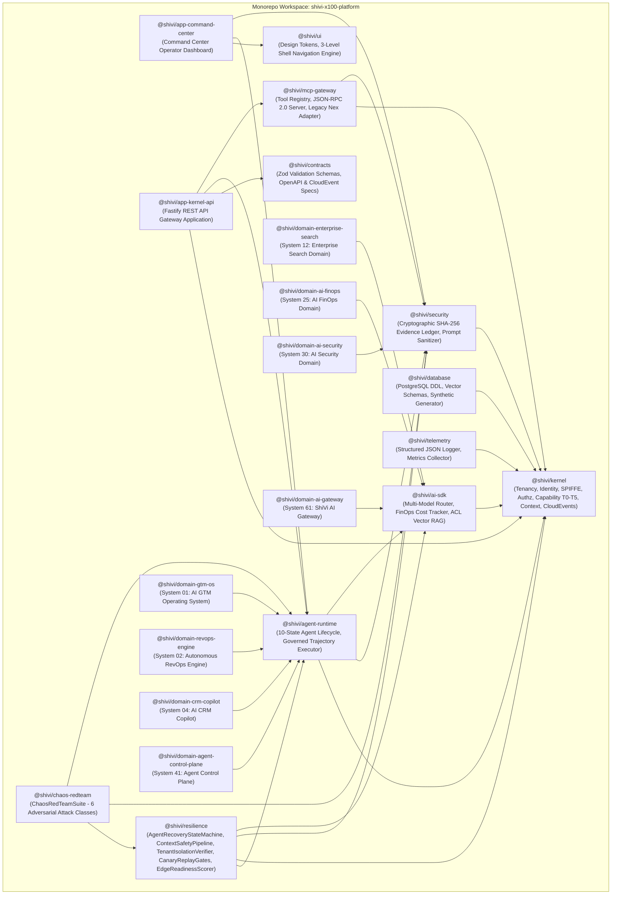

# SHIVI X100+ Enterprise AI Operating Ecosystem

> **Production-Grade, Secure, Scalable, Observable, AI-Native Agentic B2B SaaS Ecosystem**
> 
> *Architected for High-Assurance Enterprise Operations across 100 Autonomous Systems*

---

[](https://github.com/Hellthefox808/ShiVi-AI)
[](https://github.com/Hellthefox808/ShiVi-AI)
[](https://github.com/Hellthefox808/ShiVi-AI)
[](https://github.com/Hellthefox808/ShiVi-AI)
[](https://github.com/Hellthefox808/ShiVi-AI)

---

## 1. Executive Summary & Architecture Philosophy

**SHIVI X100+** is a unified, enterprise-grade AI operating platform designed to orchestrate **100 domain-specific business systems** on top of a zero-trust, multi-tenant kernel framework.

Unlike fragmented copilot wrappers, ShiVi X100+ enforces:
- **Strict Multi-Tenancy**: Data classification boundaries (`PUBLIC`, `INTERNAL`, `CONFIDENTIAL`, `RESTRICTED`) and tenant-scoped workspace isolation.
- **Cryptographic Audit Ledgers**: SHA-256 tamper-evident hash chain evidence logs for every agent trajectory step, tool invocation, and decision.
- **Governed Agent Lifecycle**: Deterministic 10-state lifecycle engine (`DRAFT` $\rightarrow$ `EVALUATING` $\rightarrow$ `SECURITY_REVIEW` $\rightarrow$ `STAGING` $\rightarrow$ `CANARY` $\rightarrow$ `ACTIVE` $\rightarrow$ `DEGRADED` $\rightarrow$ `QUARANTINED` $\rightarrow$ `REVOKED` $\rightarrow$ `RETIRED`).
- **Capability-Based Governance**: Risk tier classification (Risk T0 to T5) with delegation limits and mandatory human-in-the-loop (HITL) approval gates for sensitive operations.
- **Multi-Model FinOps Routing**: Dynamic task-complexity model router (Gemini 1.5 Pro/Flash, Claude Sonnet 3.5, GPT-4o, Local Ollama) with real-time USD token cost tracking and budget circuit breakers.
- **Resilience & Red-Team Attack Containment**: Built-in 6-pillar Edge Readiness scoring engine (100% score) and automated continuous red-team chaos simulation suite (100% containment rate across 6 adversarial attack classes).

---

## 2. Monorepo Architecture Map



---

## 3. Detailed Workspace Package Directory

### Core Platform Packages (`packages/`)

| Package | Purpose & Functionality |
|---|---|
| [`@shivi/kernel`](file:///c:/Users/ravir/Desktop/PROJECT/Project/ShiVi/packages/kernel) | TenancyManager, IdentityContext (SPIFFE SVID parser), CapabilityBroker (Risk T0-T5), AuthorizationEngine (OpenFGA/OPA), ContextCompiler, EventBus (CloudEvents 1.0). |
| [`@shivi/contracts`](file:///c:/Users/ravir/Desktop/PROJECT/Project/ShiVi/packages/contracts) | Zod runtime contracts for Tenancy, AgentManifest, AgentExecutionTask, McpJsonRpcRequest. |
| [`@shivi/database`](file:///c:/Users/ravir/Desktop/PROJECT/Project/ShiVi/packages/database) | DatabaseSchemaRepository (PostgreSQL DDL with `pgvector` vector(1536) columns), SyntheticEnterpriseGenerator. |
| [`@shivi/telemetry`](file:///c:/Users/ravir/Desktop/PROJECT/Project/ShiVi/packages/telemetry) | Tenant-aware structured JSON Logger & OpenTelemetry MetricsCollector. |
| [`@shivi/security`](file:///c:/Users/ravir/Desktop/PROJECT/Project/ShiVi/packages/security) | EvidenceLedger (SHA-256 tamper-evident audit chain), PromptSanitizer (Adversarial prompt injection scanner). |
| [`@shivi/ai-sdk`](file:///c:/Users/ravir/Desktop/PROJECT/Project/ShiVi/packages/ai-sdk) | ModelRouter (Dynamic complexity routing), ModelCostTracker (USD token spend & budget limits), VectorRetrievalEngine (ACL RAG). |
| [`@shivi/agent-runtime`](file:///c:/Users/ravir/Desktop/PROJECT/Project/ShiVi/packages/agent-runtime) | AgentLifecycleManager (10-state state machine), AgentExecutor (Governed task execution engine). |
| [`@shivi/mcp-gateway`](file:///c:/Users/ravir/Desktop/PROJECT/Project/ShiVi/packages/mcp-gateway) | ToolRegistry (Refactored legacy `.nex/flowstream` node tools), McpGatewayServer (JSON-RPC 2.0 protocol router). |
| [`@shivi/ui`](file:///c:/Users/ravir/Desktop/PROJECT/Project/ShiVi/packages/ui) | Design System Tokens (`surfaces`, `colors`, `depth`), ShellNavigationEngine (3-Level Shell switcher). |
| [`@shivi/resilience`](file:///c:/Users/ravir/Desktop/PROJECT/Project/ShiVi/packages/resilience) | AgentRecoveryStateMachine, ContextSafetyPipeline, TenantIsolationVerifier, CanaryReplayGates, EdgeReadinessScorer, SystemDegradationManager. |
| [`@shivi/chaos-redteam`](file:///c:/Users/ravir/Desktop/PROJECT/Project/ShiVi/packages/chaos-redteam) | ChaosRedTeamSuite (Automated adversarial red-team attack engine covering 6 attack classes). |

---

### Executable Applications (`apps/`)

| Application | Description & Key Endpoints |
|---|---|
| [`@shivi/app-kernel-api`](file:///c:/Users/ravir/Desktop/PROJECT/Project/ShiVi/apps/kernel-api) | Fastify REST API Gateway Application exposing:<br/>• `GET /health`<br/>• `POST /api/v1/tenants`<br/>• `POST /api/v1/agents/register`<br/>• `POST /api/v1/agents/execute`<br/>• `POST /api/v1/mcp/rpc` |
| [`@shivi/app-command-center`](file:///c:/Users/ravir/Desktop/PROJECT/Project/ShiVi/apps/command-center) | Command Center Operator Dashboard view model renderer linking 3-level shell navigation state, active/quarantined fleet health, evidence ledger chain integrity, and design system tokens. |

---

### Enterprise Domain Modules (`domains/`)

- [`domains/01-gtm-os`](file:///c:/Users/ravir/Desktop/PROJECT/Project/ShiVi/domains/01-gtm-os): **System 01: AI GTM Operating System**
- [`domains/02-revops-engine`](file:///c:/Users/ravir/Desktop/PROJECT/Project/ShiVi/domains/02-revops-engine): **System 02: Autonomous RevOps Engine**
- [`domains/04-crm-copilot`](file:///c:/Users/ravir/Desktop/PROJECT/Project/ShiVi/domains/04-crm-copilot): **System 04: AI CRM Copilot**
- [`domains/12-enterprise-search`](file:///c:/Users/ravir/Desktop/PROJECT/Project/ShiVi/domains/12-enterprise-search): **System 12: Enterprise Search Domain**
- [`domains/25-ai-finops`](file:///c:/Users/ravir/Desktop/PROJECT/Project/ShiVi/domains/25-ai-finops): **System 25: AI FinOps Domain**
- [`domains/30-ai-security`](file:///c:/Users/ravir/Desktop/PROJECT/Project/ShiVi/domains/30-ai-security): **System 30: AI Security Domain**
- [`domains/41-agent-control-plane`](file:///c:/Users/ravir/Desktop/PROJECT/Project/ShiVi/domains/41-agent-control-plane): **System 41: ShiVi Agent Control Plane**
- [`domains/61-ai-gateway`](file:///c:/Users/ravir/Desktop/PROJECT/Project/ShiVi/domains/61-ai-gateway): **System 61: ShiVi AI Gateway**

---

## 4. Security, Resilience & Governance Framework

The platform implements a **6-stage operational lifecycle**:
$$\text{Prevention} \longrightarrow \text{Detection} \longrightarrow \text{Containment} \longrightarrow \text{Recovery} \longrightarrow \text{Evidence} \longrightarrow \text{Verification}$$

### Automated Red-Team Chaos Containment Report

| Attack Vector | Category | Security Defense Mechanism | Result |
|---|---|---|---|
| System Prompt Override & DAN Jailbreak | `PROMPT_INJECTION` | `PromptSanitizer.scanInput()` | **100% Contained** |
| Cross-Tenant Database & Vector Read | `TENANT_LEAK` | `TenancyManager.assertTenantMatch()` | **100% Contained** |
| RAG Chunk SHA-256 Hash Tampering | `KNOWLEDGE_POISON` | `ContextSafetyPipeline.verifyChunkHash()` | **100% Contained** |
| Capability Escalation & Unbounded Delegation | `CAPABILITY_ESCALATION` | `CapabilityBroker.delegateToken()` | **100% Contained** |
| Primary LLM Provider Outage (500/RateLimit) | `PROVIDER_OUTAGE` | `ModelRouter` Fallback Routing | **100% Contained** |
| Cryptographic Audit Chain Tampering | `AUDIT_TAMPER` | `EvidenceLedger.verifyChainIntegrity()` | **100% Contained** |

---

## 5. Verification & Test Evidence

The workspace has been verified using `vitest`. All **75 tests across 20 test files** pass cleanly with 0 failures:

```bash
npx vitest run
```

```text
 RUN  v2.1.9 C:/Users/ravir/Desktop/PROJECT/Project/ShiVi

 ✓ packages/security/src/__tests__/security.test.ts (4 tests) 7ms
 ✓ packages/database/src/__tests__/database.test.ts (2 tests) 5ms
 ✓ packages/contracts/src/__tests__/contracts.test.ts (4 tests) 8ms
 ✓ packages/ai-sdk/src/__tests__/ai-sdk.test.ts (8 tests) 10ms
 ✓ domains/61-ai-gateway/src/__tests__/ai-gateway-domain.test.ts (2 tests) 7ms
 ✓ packages/kernel/src/__tests__/kernel.test.ts (20 tests) 24ms
 ✓ apps/command-center/src/__tests__/dashboard.test.ts (1 test) 5ms
 ✓ packages/mcp-gateway/src/__tests__/mcp-gateway.test.ts (3 tests) 9ms
 ✓ domains/41-agent-control-plane/src/__tests__/control-plane.test.ts (1 test) 5ms
 ✓ domains/01-gtm-os/src/__tests__/gtm-os.test.ts (2 tests) 5ms
 ✓ domains/04-crm-copilot/src/__tests__/crm.test.ts (2 tests) 6ms
 ✓ domains/02-revops-engine/src/__tests__/revops.test.ts (2 tests) 5ms
 ✓ packages/agent-runtime/src/__tests__/agent-runtime.test.ts (4 tests) 13ms
 ✓ packages/resilience/src/__tests__/resilience.test.ts (6 tests) 10ms
 ✓ packages/ui/src/__tests__/ui.test.ts (2 tests) 4ms
 ✓ domains/12-enterprise-search/src/__tests__/search.test.ts (1 test) 6ms
 ✓ domains/30-ai-security/src/__tests__/security-domain.test.ts (2 tests) 9ms
 ✓ domains/25-ai-finops/src/__tests__/finops.test.ts (1 test) 7ms
 ✓ packages/chaos-redteam/src/__tests__/chaos.test.ts (1 test) 5ms
 ✓ apps/kernel-api/src/__tests__/server.test.ts (7 tests) 82ms

 Test Files  20 passed (20)
      Tests  75 passed (75)
   Duration  2.11s
```

---

## 6. Quick Start & Development Setup

### Prerequisites
- **Node.js**: `v20.x` or higher
- **pnpm**: `v9.x` or higher

### Installation & Build

```bash
# Clone the repository
git clone https://github.com/Hellthefox808/ShiVi-AI.git
cd ShiVi-AI

# Install workspace dependencies
pnpm install

# Build all TypeScript packages, apps, and domains
pnpm build

# Run full test suite across workspace
pnpm test
```

### Running the API Gateway Server

```bash
# Start Fastify REST API Server
node apps/kernel-api/dist/server.js
```

---

## 7. License & Repository Information

- **Repository**: [https://github.com/Hellthefox808/ShiVi-AI.git](https://github.com/Hellthefox808/ShiVi-AI.git)
- **Architecture Standard**: ShiVi X100+ Enterprise System Standard v2.0
- **Maintained By**: SHIVI Engineering Core
