# ShiVi — AI-Native B2B Revenue + GTM + Agent Operating Platform
## Platform Overview & Canonical Mission

> **North Star**: ShiVi is an AI-native, multi-tenant, enterprise-grade B2B operating system that connects business strategy, CRM data, AI agents, governed tools, durable workflows, zero-trust security, and continuous compliance into one cohesive ecosystem.

---

### The Three Primary Worlds

ShiVi is structured across three fundamental worlds:

```mermaid
flowchart LR
    subgraph Product ["1. PRODUCT (What Users Use)"]
        P1[Prospecting & Intelligence]
        P2[Outreach & Campaigns]
        P3[Pipeline & Forecast]
        P4[AI Copilots & Analytics]
    end

    subgraph Architecture ["2. ARCHITECTURE (What The System Is)"]
        A1[Platform Kernel]
        A2[AI Gateway & Model Router]
        A3[Agent Runtime & 38 Roster]
        A4[Durable Workflow Engine]
        A5[6-Layer Governance Fabric]
    end

    subgraph Infrastructure ["3. INFRASTRUCTURE (Where It Runs)"]
        I1[Zero-Trust VPC & Edge WAF]
        I2[PostgreSQL System of Record]
        I3[Redis Cache & Outbox Queues]
        I4[pgvector Hybrid RAG]
        I5[OpenTelemetry & KMS Vault]
    end

    Product --> Architecture
    Architecture --> Infrastructure
```

1. **PRODUCT**: The intuitive glassmorphic user experience, 10 core application modules, interactive workflow studio, and executive decision intelligence.
2. **ARCHITECTURE**: Canonical components, bounded contexts, contracts, strict multi-tenant kernel, capability token system (T0–T5), and 8-step decision lineage.
3. **INFRASTRUCTURE**: Reproducible Terraform IaC, PostgreSQL system of record, Redis outbox queues, pgvector semantic search, and OpenTelemetry instrumentation.

---

### Canonical Platform Principles

- **One System**: No disconnected features or siloed AI tools.
- **UI Truth**: The UI is a direct projection of verified system truth.
- **Context Loop**: Discover ➔ Model ➔ Security ➔ Implement ➔ Test ➔ Verify ➔ Observe.
- **Fail-Closed Governance**: When security or safety checks are indeterminate, high-impact actions fail closed.
