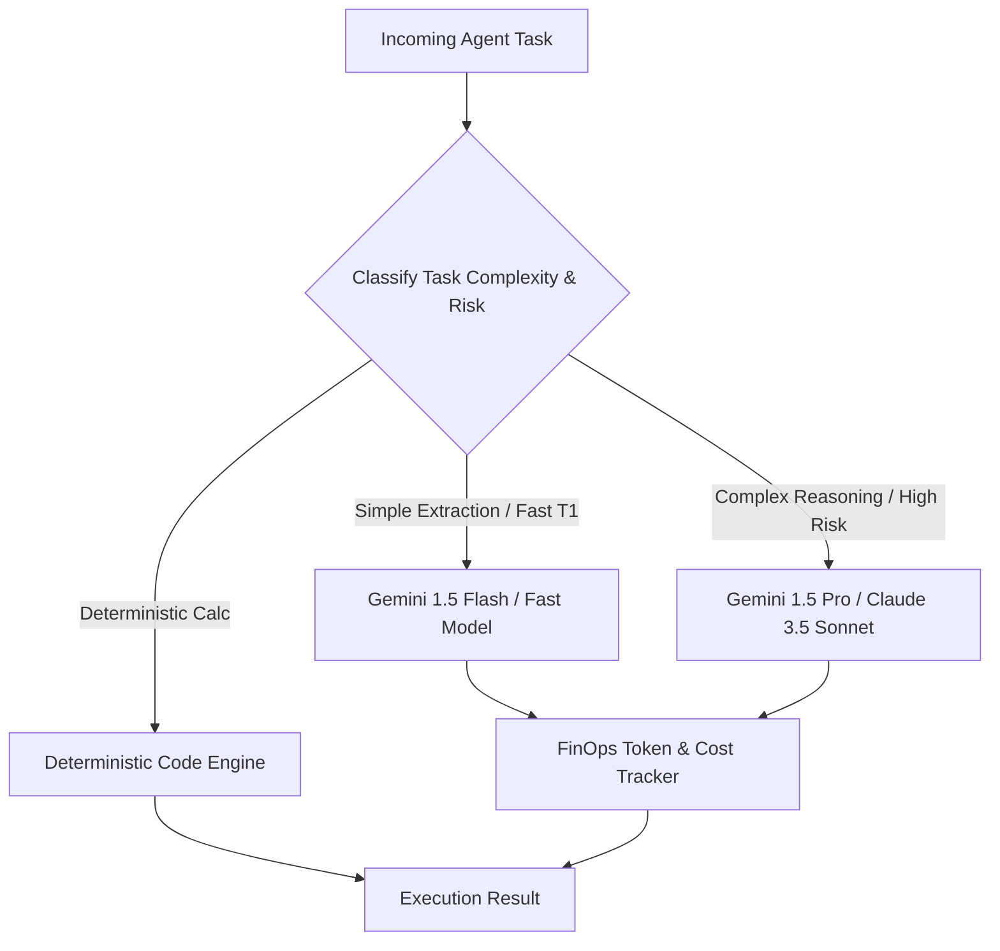

# Intelligence & Agent Architecture
## AI Gateway, Model Router & 38 Specialized Agents

The ShiVi Intelligence Layer enforces a single governed entrypoint for all LLM interactions.

---

### 1. AI Gateway & Multi-Model Router



---

### 2. Scoped Agent Memory Engine

Memory is strictly isolated into 4 hierarchical tiers:
1. **Working Memory**: Ephemeral per-turn context (TTL: 1 hour).
2. **Task Memory**: Scoped to the lifecycle of a specific workflow execution.
3. **Agent Memory**: Agent-specific operational heuristics and calibration data.
4. **Account & Organization Memory**: Verified long-term relationship insights, stakeholder maps, and contract milestones.

---

### 3. Agent Lifecycle

```
DRAFT ➔ TEST ➔ EVALUATE (Harness) ➔ APPROVE ➔ CANARY ➔ PRODUCTION ➔ MONITOR (Drift) ➔ ROLLBACK / DEPRECATE
```
