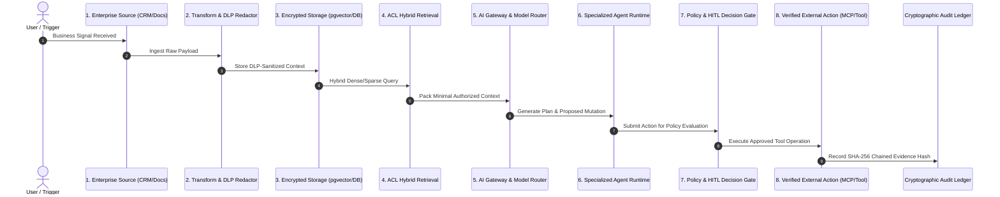

# Data Flow & Decision Lineage Architecture
## 8-Step Governed Decision Flow

Every consequential AI decision within ShiVi is strictly traceable through 8 deterministic stages:

---

### Context Engine Guidelines
- **Relevant & Minimal**: Never dump entire databases or full account histories into context.
- **Pre-Context Sanitization**: PII (emails, phones, SSNs, credit cards, API keys) is redacted before prompt generation.
- **Traceable**: Every context item carries document ID, chunk index, timestamp, and security classification.
