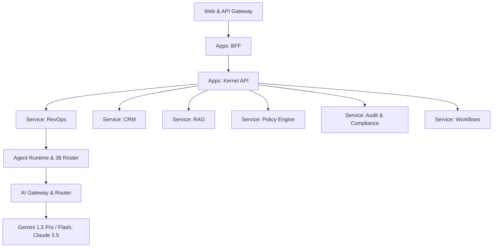

# ShiVi System Architecture & Platform Kernel
## Canonical System Decomposition

The ShiVi platform architecture separates the common control layer (**Platform Kernel**) from domain-specific intelligence.

---

### 1. Platform Kernel Primitives (`packages/kernel`)

No domain service re-implements core kernel responsibilities:
- **Identity & Authentication**: Session tokens, SPIFFE SVID verification, and tenant context binding.
- **Tenancy Isolation**: Strict cryptographic tenant isolation enforcing database row-level security, vector namespace segregation, and cache key prefixing.
- **Authorization (RBAC + ABAC)**: Contextual evaluation checking `(Principal, Action, Resource, Environment)`.
- **Capability Token System (T0–T5)**:
  - **T0**: Read-only public / metadata operations.
  - **T1**: Internal analytics & read-only querying.
  - **T2**: Draft generation & non-consequential mutations.
  - **T3**: High-impact business mutations (Stage advance, Outreach dispatch). Requires policy/HITL check.
  - **T4**: Financial, pricing, contract mutation. Requires dual approval.
  - **T5**: Administrative, data deletion, kill-switch activation.

---

### 2. Service Map

