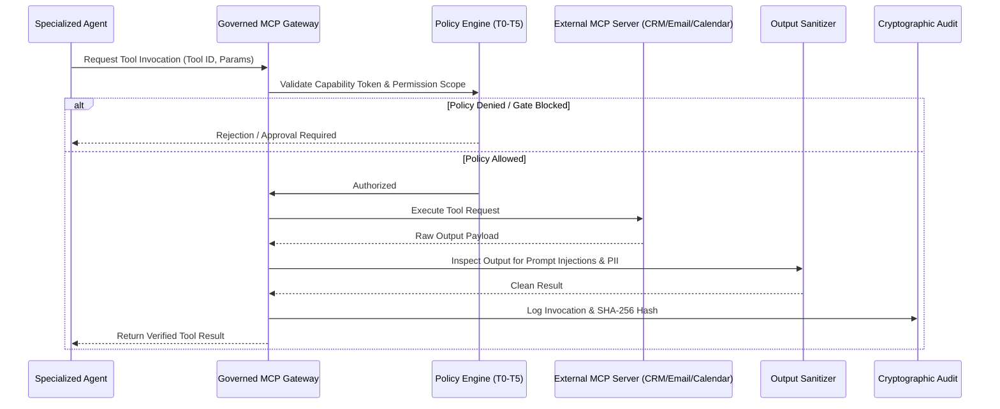

# Integrations & Governed MCP Gateway
## Model Context Protocol (MCP) & Adapter Architecture

ShiVi treats all external tool interactions as untrusted until verified through the **Governed MCP Gateway**.

---

### Governed Tool Execution Flow

---

### Adapter Pattern
Business logic depends exclusively on typed adapter interfaces (e.g. `CRMAdapter`, `EmailAdapter`), allowing seamless switching between mock test harnesses and live production integrations (Salesforce, HubSpot, SendGrid, Gmail).
